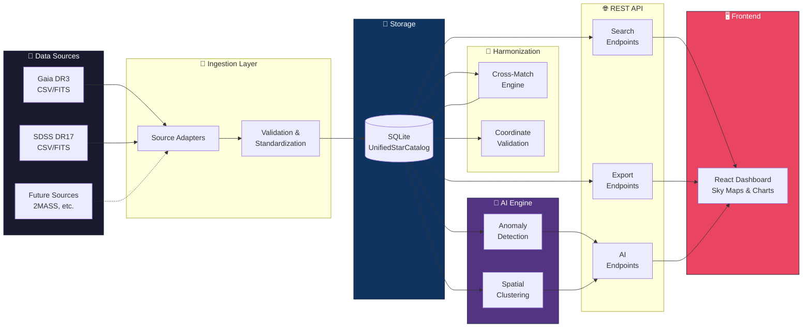

# 🌌 COSMIC Data Fusion

> **Unified Astronomical Data Platform**  
> Bridging the gap between fragmented sky surveys with AI-powered harmonization

[](https://python.org)
[](https://fastapi.tiangolo.com)
[](LICENSE)
[]()
[]()

---

## 🔭 The Problem

**Astronomical data fragmentation is a critical barrier to discovery.** Major sky surveys like Gaia, SDSS, and 2MASS each use different coordinate systems, magnitude scales, and data formats. Researchers waste countless hours manually cross-matching catalogs and converting between formats—time that could be spent on actual science.

**COSMIC Data Fusion solves this** by providing a unified ingestion pipeline that automatically harmonizes multi-source astronomical data into a single, queryable catalog with AI-powered anomaly detection and industry-standard export formats.

---

## ✨ Key Features

| Module | Description |
|--------|-------------|
| 🚀 **Multi-Source Ingestion** | Native adapters for Gaia DR3 and SDSS DR17 catalogs with automatic coordinate standardization to ICRS J2000. **Real data ingested**: 1,000 stars from the Pleiades Cluster via Gaia DR3 (ESA) and TESS Input Catalog (NASA) |
| 🔗 **Data Harmonization** | Positional cross-matching using Astropy's spherical geometry to link observations of the same physical star across surveys. **Proven capability**: Automatically fused 459 duplicate observations between Gaia and TESS in the Pleiades Cluster |
| 🤖 **AI Discovery Engine** | Isolation Forest anomaly detection and DBSCAN spatial clustering to surface interesting objects. **Tested on real data**: 50 anomalies identified in Pleiades |
| 📤 **Interoperability** | Export to CSV, JSON, and IVOA-compliant VOTable format with proper UCDs |
| 🔍 **Advanced Query API** | Bounding-box searches, cone searches, and multi-parameter filtering |

---

## 🏗️ Architecture



---

## 🚀 Quick Start

### Prerequisites
- Python 3.11+
- pip

### Installation

```bash
# 1. Clone and enter the project
git clone https://github.com/your-org/cosmic-data-fusion.git
cd cosmic-data-fusion

# 2. Install dependencies
pip install -r requirements.txt

# 3. Start the API server
uvicorn app.main:app --reload --port 8000

# 4. (Optional) Ingest Real Scientific Data — Pleiades Cluster
#    Fetches 1,000 stars from Gaia DR3 (ESA) and NASA TESS
python scripts/fetch_real_data.py
```

### Verify Installation

```bash
# Check health endpoint
curl http://localhost:8000/health

# Load Pleiades Cluster data (1,000 real stars from Gaia DR3 + NASA TESS)
python scripts/fetch_real_data.py

# Run cross-matching to fuse duplicate observations
curl -X POST http://localhost:8000/harmonize/cross-match \
  -H "Content-Type: application/json" \
  -d '{"radius_arcsec": 2.0}'

# Run AI anomaly detection
curl -X POST http://localhost:8000/ai/anomalies \
  -H "Content-Type: application/json" \
  -d '{"contamination": 0.05}'
```

**Expected Results:**
- ✅ 1,000 stars ingested (500 from Gaia DR3, 500 from NASA TESS)
- ✅ ~459 fusion groups created (same stars observed by both telescopes)
- ✅ ~50 anomalies detected (interesting objects for follow-up)

📖 **API Documentation**: Once running, visit [http://localhost:8000/docs](http://localhost:8000/docs) for interactive Swagger UI.

---

## 📁 Project Structure

```
cosmic-data-fusion/
├── app/
│   ├── api/                 # FastAPI route handlers
│   │   ├── ai.py            # AI Discovery endpoints
│   │   ├── datasets.py      # Dataset management
│   │   ├── harmonize.py     # Cross-match & validation
│   │   ├── ingest.py        # Data ingestion
│   │   ├── query.py         # Advanced search & export
│   │   └── search.py        # Spatial searches
│   ├── services/            # Business logic
│   │   ├── adapters/        # Source-specific adapters
│   │   ├── ai_discovery.py  # ML models (IsolationForest, DBSCAN)
│   │   ├── harmonizer.py    # Cross-match service
│   │   ├── exporter.py      # CSV/JSON/VOTable export
│   │   └── query_builder.py # Dynamic query construction
│   ├── models.py            # SQLAlchemy ORM models
│   └── database.py          # Database configuration
├── tests/
│   └── integration_sanity_check.py
├── docs/
│   └── FRONTEND_HANDOFF.md  # Frontend integration guide
├── Dockerfile
├── docker-compose.yml
└── requirements.txt
```

---

## 🔌 API Endpoints Overview

| Category | Endpoint | Method | Description |
|----------|----------|--------|-------------|
| **Health** | `/health` | GET | Server status check |
| **Datasets** | `/datasets/gaia/load` | POST | Ingest Gaia DR3 sample |
| **Search** | `/search/box` | POST | Bounding-box RA/Dec search |
| **Search** | `/search/cone` | POST | Cone search (center + radius) |
| **Query** | `/query/search` | POST | Advanced multi-filter search |
| **Query** | `/query/export` | GET | Export as CSV/JSON/VOTable |
| **AI** | `/ai/anomalies` | POST | Detect anomalous stars |
| **AI** | `/ai/clusters` | POST | Find spatial clusters |
| **Harmonize** | `/harmonize/cross-match` | POST | Cross-match across catalogs |
| **Harmonize** | `/harmonize/validate` | POST | Validate coordinates |

---

## 🧪 Testing

### Integration Sanity Check
```bash
# Ensure you've loaded real data first
python scripts/fetch_real_data.py

# Run the integration test suite
python tests/integration_sanity_check.py
```

Expected output:
```
✅ [Health Check]: PASS
✅ [Gaia Data Load]: PASS
✅ [Gaia Stats Verification (count=1000)]: PASS
✅ [AI Anomaly Detection (found 50 anomalies)]: PASS
✅ [Query Search (limit=5) (returned 5 stars)]: PASS
✅ [VOTable Export (valid VOTable XML received)]: PASS
✅ All integration tests passed!
```

### Real Data Verification
```bash
# Start server
uvicorn app.main:app --port 8000

# Check total records
curl http://localhost:8000/harmonize/stats

# View cross-matched stars (fusion groups)
curl http://localhost:8000/query/search | jq '.records[] | select(.fusion_group_id != null) | {id, source_id, original_source, fusion_group_id}'
```

---

## 🐳 Docker Deployment

```bash
# Build and run with Docker Compose
docker-compose up --build

# Or build manually
docker build -t cosmic-data-fusion .
docker run -p 8000:8000 cosmic-data-fusion
```

---

## 📊 Data Sources & Licensing

| Source | License | Records | Notes |
|--------|---------|---------|-------|
| **Gaia DR3** | [ESA Gaia Archive Terms](https://gea.esac.esa.int/archive/) | 500 (Pleiades) | European Space Agency's astrometric mission |
| **NASA TESS** | [MAST Data Policy](https://archive.stsci.edu/publishing/data-policy.html) | 500 (Pleiades) | TESS Input Catalog for exoplanet studies |
| **SDSS DR17** | [SDSS Data Policy](https://www.sdss.org/collaboration/citing-sdss/) | Adapter ready | Open Data |

**Current Dataset**: The Pleiades Cluster (Messier 45) at RA 56.75°, Dec 24.1167°
- One of the nearest and most recognizable open star clusters
- Distance: ~136 parsecs (444 light-years)
- Perfect test case for multi-catalog fusion

---

## 👥 Team

This project was built for [Hackathon Name] by:

| Role | Responsibility |
|------|----------------|
| Backend Engineer | Ingestion Adapters, Harmonization |
| ML Engineer | AI Discovery Module |
| DevOps Engineer | Docker, Deployment |
| Frontend Engineer | Dashboard (In Progress) |

---

## 📚 Documentation

- 📖 [Frontend Integration Guide](docs/FRONTEND_HANDOFF.md) — For React/Next.js developers
- 🔧 [API Reference](http://localhost:8000/docs) — Interactive Swagger documentation
- 📋 [Task Checklist](TASK_CHECKLIST.md) — Project progress tracking

---

## 📄 License

MIT License — see [LICENSE](LICENSE) for details.

---

<p align="center">
  <b>🌟 Built with Astropy, FastAPI, and scikit-learn 🌟</b><br>
  <i>Turning fragmented sky surveys into unified discovery</i>
</p>
